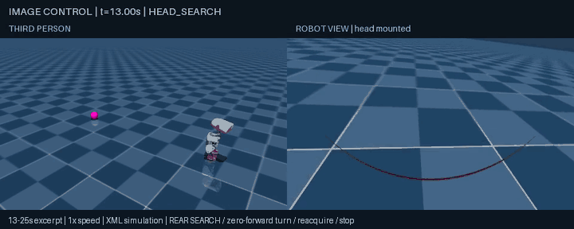
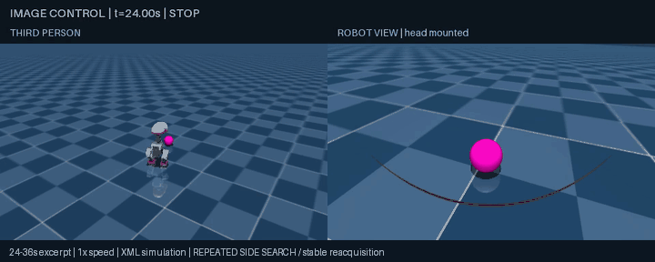

# Bounded rear search — September 12, 2026

The four-step iteration is verified: compare bounded turns, recover a rear target, repeat side reacquisition, and run regressions before exporting representative media. Existing policies and coordinate controllers remain unchanged.

## Results

| Check | Outcome |
| --- | --- |
| Zero-forward yaw command ±1.2, target ±90 degrees | Both reached the target and settled without falling. Final angles +1.687/-1.572 rad; final displacement 0.0074/0.0221 m. |
| Walking turn vx=0.3, yaw ±1.2 | Both reached the target, but final displacement was 0.2350/0.2043 m and right-turn angular overshoot was larger. |
| Rear target after head sweep | Zero-forward body turn reacquired the ball at t=17.44; alignment completed at 18.86, stop commanded at 24.00. Final distance 0.3052 m; no fall/contact. Peak displacement during blind body scan was 0.0215 m or less. |
| Four alternating side departures over 84 s | Four stable reacquisitions; all four final pause windows stopped below 0.01 m/s. Minimum search-state transition interval 1.30 s. No fall/contact. |
| Persistent missing camera frames | Search exhausted its angular budget and entered GAVE_UP at t=18.06, then remained at zero commands. This is an expected unsuccessful-search safety result, not target-acquisition success. |
| Original coordinate regressions | Standing, push, left/right/behind static balls and moving target all match every original recorded trajectory field exactly (sum of 400 + 400 + 900 + 1,200 + 1,500 + 2,100 samples). |
| Visual regressions with search enabled | Static, moving/pausing, temporary black frames and physical occlusion all passed. Commands replay exactly from image features, timestamps and robot proprioception. |

Seventeen unit tests pass. These deterministic trials establish a tested operating point, not robustness over arbitrary gait phases, surfaces or hardware. The previous yaw=0.8 failure remains valid historical evidence: it does not imply yaw=1.2 behaves the same. Requested and achieved motion differ, including settling overshoot.

## Controller bounds and sensing

Implementation limits: body pose supplied to the controller is simulator state, standing in for odometry; real contact odometry has not been integrated or validated. The experiment runner records falls, but its original fall-triggered zero-command override currently applies only outside vision mode. The passing trials reported here had no detected falls and do not validate post-fall behavior. See `HARDWARE_SIGNALS.md` for real sensor and localization limitations.

`BoundedTurn` uses robot odometry only. The search turn commands zero forward velocity, yaw=1.2, with a maximum 180-degree sweep, six seconds, 0.7 m accumulated path and 0.15 m displacement. Acquisition can terminate the scan earlier. The whole loss/search/alignment episode is capped at 28 seconds and 0.5 m displacement. GAVE_UP is latched; a failed search cannot chatter back into movement. These checks bound commands; they are not a collision-avoidance system or a guarantee of instantaneous physical stopping.

Target control uses actual RGB detections. Head angle and body odometry are robot proprioception; target coordinates are environment/evaluator-only. Head sweep, stable six-frame confirmation and body alignment are preserved. No blind forward fallback was needed.

## Reproduce without routine media export

```bash
microduck-lab/.venv/bin/python sim/experiment.py --mode turn --turn-speed 0 --seconds 16 --out runs/turn-yaw
microduck-lab/.venv/bin/python sim/experiment.py --mode ball --ball .8 0 --seconds 40 \
  --vision --search --search-scenario behind --out runs/rear
microduck-lab/.venv/bin/python sim/experiment.py --mode ball --ball .8 0 --seconds 84 \
  --vision --search --search-scenario repeat --out runs/repeat
```

`--vision` now renders the required RGB camera without creating a video. `--snapshot-times 15 18 24` saves targeted diagnostic frames. Add `--video --dual-view` only for a desired recording. Per-run summaries include wall time and instrumented render, detection, inference, physics and encoding costs. They do not assign uninstrumented time to model reasoning.

Final media was rendered after behavioral acceptance: a 32-second rear-search recording and a 40-second representative two-departure recording. Recorded runs passed independent behavioral checks and image/proprioception command replay. Their image detections and trajectories are not bit-identical to camera-only runs; the source of the small raster differences was not isolated. Do not treat the recording as an exact replay of the longer run. The full four-departure test is in numerical logs; the shorter representative recording is not presented as showing all four.





Detailed outcomes are in `sim/results/bounded-search.json`. Prior failed scans are preserved in `VISUAL_SEARCH.md`. No training, VLM, hardware test, publication or claim of obstacle/drop-off safety is included. Proposed next work is in `ROADMAP.md`.
