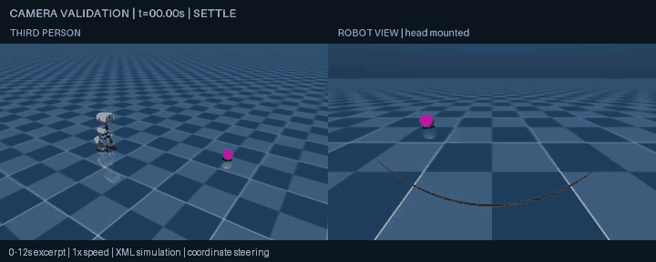

# Virtual-camera validation — September 12, 2026

Historical camera-only milestone. Image control and rear search were implemented later; see `VISION_FOLLOW.md` and `BOUNDED_SEARCH.md` for subsequent results. Pending statements below describe this earlier milestone.

A head-mounted virtual camera now renders alongside the third-person view. Both panels are rendered from the same MuJoCo state before the next physics step. Existing coordinate-based steering remains in control; these images do not drive the robot.

## Camera definition

`sim/camera_view.py` adds `robot_view` at the upstream `head_camera` position on `jaw_soft`, preserving the external model and its original camera. Inspection of the neutral policy pose showed the upstream camera viewing toward robot -X with a rotated image basis. The new camera's fixed local rotation is calibrated once at initialization: +X forward, image right toward robot -Y, image up toward world +Z, with a 25-degree downward aim and 70-degree vertical field of view. Thereafter MuJoCo moves it with the head, including head articulation and body pitch/roll/yaw. It is not re-aimed at the ball.

These are idealized virtual optics, not calibrated hardware specifications. A small arc of the robot's own geometry is visible in the lower image; it is retained. Ball appearance is changed to magenta only when dual view is enabled. Ball geometry, physics, steering, and shipped ONNX policies are unchanged.

## Reproduce

From the repository root, using the environment described in `SIMULATION.md`:

```bash
microduck-lab/.venv/bin/python sim/experiment.py \
  --mode ball --ball 0.8 0.35 --seconds 18 \
  --video --dual-view --camera-check --out runs/camera-validation
```

The output contains a full 18-second `rollout.mp4`, synchronized camera poses, trajectory, summary, and ten labeled check images with `checks/checks.json`. The MP4 uses a consistent 960×384 canvas, two 480×288 panels, headers/footer, and 25 fps at real-time playback. The supplied GIF is a 0–12 s excerpt at real-time playback; its footer identifies the excerpt. Snapshot tests impose poses and are explicitly labeled separately from the physical recording.

## Verified results

- All ten rendered checks passed: front, left-front, right-front, outside-left and behind, at robot yaw 0 and 90 degrees. Front targets are centered, left/right targets appear on their expected image side, and out-of-view targets produce zero ball segmentation pixels.
- Projected ball centers agree with visible segmentation centroids within 0.89 pixels. Segmentation and simulator geometry are used only by this evaluator, never by a perception controller.
- The actual 18-second approach recording contains 450 synchronized frame pairs. Camera heading changes during simulated walking. The robot stops at 0.2063 m trunk-to-ball-center distance with no detected fall or robot-ball contact.
- All 900 static-run samples match the previous run's original trajectory fields exactly. The older static log predates four target-telemetry fields, so byte equality is not the comparison used.
- A separate 42-second coordinate-follow regression matches all 2,100 prior samples and fields exactly. The four existing follow-controller tests pass.

Checks and regression evidence are in `sim/results/camera-validation.json`. The new code, docs, and media are local changes; no publication is part of this iteration.



## Next experiment, not implemented

Image-only magenta-ball detection, horizontal-offset steering, apparent-size proximity, and stopping on lost sight remain pending. A future image controller should receive only image-derived observations; ground truth should be evaluator-only. No retraining, BAM validation, or hardware testing occurred.
