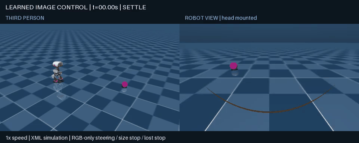
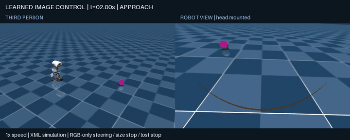
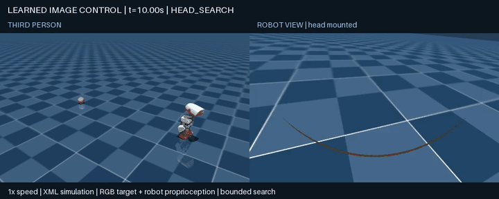
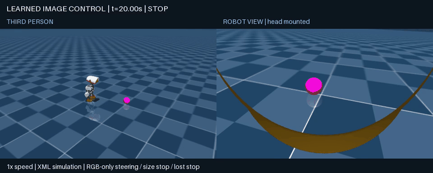

# Learned visual controller — September 12, 2026

## Verdict: PARTIAL

This run trained a small local ONNX visual controller above the existing
walking/standing policies. It consumes only the magenta ball's RGB-derived
horizontal offset and apparent size, plus its own last executed action. Missing
frames force zero commands outside the learned model. The existing bounded
search, fall and close-target guards remain independent rules.

The model generalized across a small frozen static-position grid and passed the
recorded rear-search and blackout cases. It did **not** reliably pass dynamic
follow when presentation video was enabled, so it is not a replacement for the
rules controller for that behavior.

## What was trained

`sim/train_visual_controller.py` creates synthetic, changing-bearing sequences
from the existing visual rules controller, then fits a 4→16→16→2 MLP locally.
Its output is a move/stop logit and a bounded yaw value. The published model is
[`sim/models/visual-controller-v1.onnx`](sim/models/visual-controller-v1.onnx)
with its training metadata in
[`sim/models/visual-controller-v1.json`](sim/models/visual-controller-v1.json).

The final checkpoint used seed 7, 1,800 epochs, 42,176 train and 10,544
validation examples. Validation move accuracy was 97.22%; moving-state yaw MSE
was 0.0080. These are teacher-distribution metrics, not the behavioral result.
The first continuous-command model failed to stop, and the first move/stop
model lost the ball through steering drift; both failures led to the revised
move/stop target and changing-bearing training data.

## Closed-loop results

| Scenario | Learned controller result | Rules comparison | Interpretation |
| --- | --- | --- | --- |
| Frozen static grid: 12 positions, x ∈ {0.65, 0.80, 0.95} m and y ∈ {−0.35, −0.12, 0.12, 0.35} m | 12/12 passed | 12/12 passed | Small held-out position generalization; no measured improvement over rules. |
| Recorded static approach | PASS: stopped at 0.283 m; no fall/contact | Not rerun as a presentation baseline | Visual evidence below. |
| 2 s black camera interval | PASS: zero commands while missing; resumed and stopped at 0.286 m; no fall/contact | Existing rules behavior preserved | A missing frame stream is not an obstacle-safety test. |
| Recorded rear search | PASS: reacquired at 20.08 s and stopped at 0.245 m; no fall/contact | Rules also passed | Existing bounded head/body search remains rule-based. |
| Headless scripted moving follow | PASS: final distance 0.289 m; pause/resume checks passed | Not a comparative improvement claim | A single deterministic trajectory. |
| Recorded scripted moving follow | FAIL: final distance 0.592 m after the second departure | N/A | The failure reproduced with presentation recording enabled; source not isolated. Dynamic following is not accepted. |

All final result runs use XML position actuators rather than BAM dynamics. The
published external model/policy files remain unchanged. The simulator uses an
idealized camera and a controlled magenta ball; no result establishes clutter,
object generalization, obstacle/drop-off safety, real sensing or hardware
readiness.

## Evidence

The clips are real-time excerpts from independently checked runs. They label
the trained controller, show third-person and robot views, and are explicitly
simulation-only.









## Reproduce

Use the local environment described in `SIMULATION.md`. No cloud training,
model API or paid service is required.

```sh
microduck-lab/microduck_local/.venv/bin/python -B -m unittest discover -s sim -p 'test_*.py'
microduck-lab/microduck_local/.venv/bin/python sim/evaluate_holdout.py \
  --python microduck-lab/microduck_local/.venv/bin/python \
  --model sim/models/visual-controller-v1.onnx \
  --out runs/reproduced-heldout
microduck-lab/microduck_local/.venv/bin/python sim/experiment.py \
  --mode ball --ball 0.8 0.35 --seconds 18 --vision \
  --vision-controller learned --controller-model sim/models/visual-controller-v1.onnx \
  --out runs/reproduced-static
```

## Findings and proposed next steps

1. Freeze the rules controller as the operational baseline. It matched the
   learned model on static positions and has no demonstrated dynamic regression.
2. Diagnose recorded dynamic-follow divergence before more fitting: isolate the
   extra rendering path, preserve pixel/command traces, and compare fresh
   recorded rollouts to the headless path. Do not train on the frozen static
   grid or call the current model an improvement.
3. If dynamic behavior becomes repeatable, use learner-visited camera states
   with teacher labels, then evaluate a separate held-out moving trajectory
   suite. Only afterwards consider perceptual distractors or realistic sensors.

## Validation and publication boundary

Twenty unit tests passed after implementation. The public artifact set contains
only source, a compact local model and metadata, this report, and reviewed
simulation GIFs. Raw trajectories, MP4s, virtual environments, external
dependencies and run directories remain ignored.
