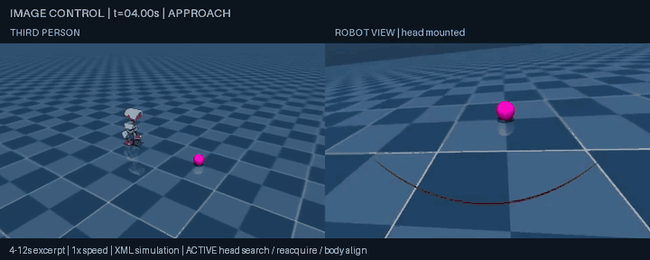
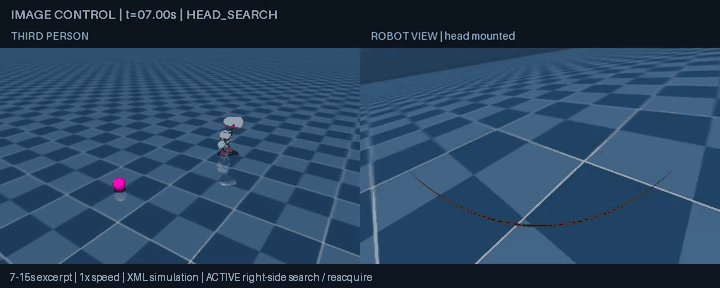
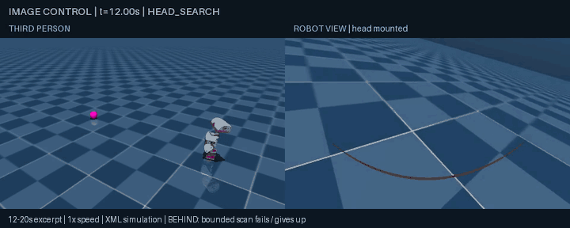
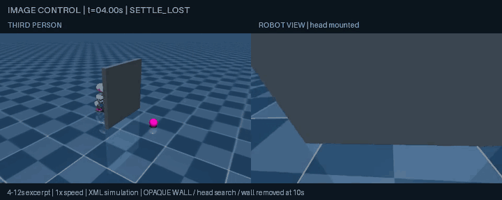

# Active visual search — September 12, 2026

Historical first iteration: the yaw=0.8 rear-search failure below was superseded by the measured bounded yaw=1.2 experiment in `BOUNDED_SEARCH.md`. Keep both results; the operating points differ.

`--vision --search --dual-view` adds a bounded search state machine above the existing policies. The target observation is still derived only from camera RGB. A head-joint encoder supplies the head angle needed to turn the body toward a ball seen off to one side; no target/world coordinates enter the search controller. The stock locomotion policies retain their normal proprioceptive observations.

On loss, the robot commands zero motion for a 1.5-second settling phase. It then sweeps its head between ±1.1 rad at a commanded rate no greater than 0.6 rad/s. Six distinct valid camera frames are required for reacquisition. The head tracks the image while the body aligns, then the original image follower resumes. A close target prevents forward alignment motion. If head search fails, a six-second in-place body scan commands vx=0 and yaw=0.8 rad/s; it stops and gives up when the timer expires. These are command bounds, not a guarantee that the physical motion exactly follows them.

## Verified results

| Environment | Verified outcome |
| --- | --- |
| Ball moves left during t=4–6 s | Lost at 5.00; head scan at 6.50; stable reacquisition at 8.20; body aligned/track at 11.58. Final stop distance 0.2962 m. |
| Ball moves right during t=4–4.4 s | Lost at 4.20; head scan at 5.70; stable reacquisition at 11.44; body aligned/track at 14.46. Final stop distance 0.2564 m. |
| Ball moves behind during t=4–6 s | **Failed to reacquire.** Head scan exhausted, body scan ran t=13.32–19.32, then GAVE_UP. Actual body yaw changed only 0.1485 rad and translated 0.0031 m during the scan. Final distance 1.1120 m. No blind forward walking was used. |
| Opaque physical wall blocks ball t=4–10 s | Stopped and scanned; all 30 evaluator samples during occlusion had zero visible ball pixels and no detections. Wall was explicitly moved away at t=10; stable reacquisition at 10.20, track at 10.88, final stop distance 0.3014 m. No detected robot-wall or robot-ball contact. This does not demonstrate seeing through or navigating around a permanent obstacle. |

All four trials had no detected fall or robot-ball contact. Head commands were bounded to ±1.1 rad, but the maximum measured head angle in successful side trials reached 1.289 rad: the existing policy can overshoot the requested angle. Head-search body commands were zero. The final controller reproduces every recorded command in these four trials from RGB-derived observations, timestamps and head encoder alone. The settling gate was tightened after the first three recordings; their command replays remain exact under the final controller. The occluder run used that final gate directly.

An earlier slower right-side trial regained the target before head search, so it is retained as passive recovery and is not counted as active-search evidence. The faster right-side scenario above actually exercises the head sweep.

## Reproduce

Use the environment in `SIMULATION.md`, from the repository root:

```bash
microduck-lab/.venv/bin/python sim/experiment.py --mode ball --ball 0.8 0 \
  --seconds 30 --video --dual-view --vision --search \
  --search-scenario left --out runs/search-left
```

Use `right --search-move-seconds 0.4`, `behind`, or `occluder` for the other scenarios (26 seconds is sufficient for the occluder run). Scenario target paths and the moving occluder belong to the evaluator/environment, never the controller. The behind-target path is an arc, not a teleport through the robot.

```bash
microduck-lab/.venv/bin/python sim/check_vision_run.py runs/search-left
microduck-lab/.venv/bin/python -m unittest discover -s sim -p 'test_*.py'
```

Thirteen tests cover detection, size hysteresis, lost/stale stopping, settling, distinct-frame confirmation, scan bounds/timeouts and refusing to walk toward a close reacquired ball. Final coordinate-baseline regressions still match all original fields in 900 static and 2,100 dynamic samples. Numerical evidence is in `sim/results/visual-search.json` and `sim/results/vision-follow.json`.

The dual-view MP4s are real simulation recordings at 25 simulated fps. GIF excerpts retain the same 720×288 canvas, title/footer treatment, real-time speed and a palette with reserved magenta shades. Search uses RGB target observations plus the head encoder even where the earlier recording footer abbreviates this as RGB-only steering.









## Limits and next decision

Reliable behind-target search is not solved. The shipped XML-model gait barely rotates under the bounded in-place yaw command; a reliable turn primitive or explicitly bounded walking-arc search would require a separate measured experiment. Do not assume a larger command or longer blind movement is safe. Permanent occlusion, multiple magenta distractors, varied lighting and hardware remain unvalidated. Basic moving-ball following also retains a brief detection loss documented in `VISION_FOLLOW.md`.

No policy training, VLM, BAM test, hardware execution or external publishing occurred. All current changes are local and uncommitted.
