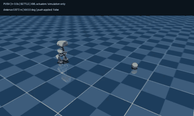
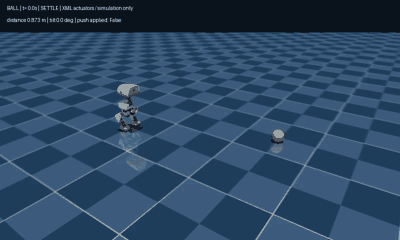
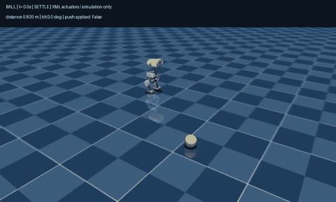
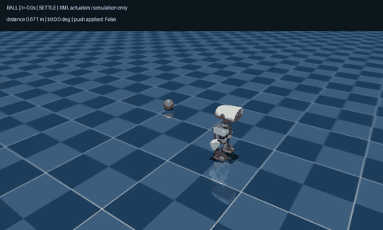
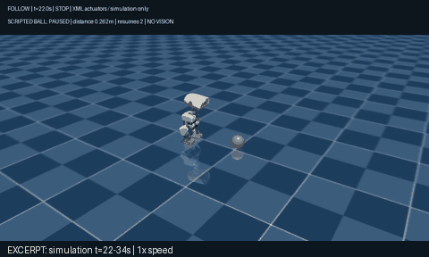

# First simulation experiments

September 9, 2026 · Existing policies, visible motion, no training

Microduck can recover from a small simulated push, approach a stationary ball
from three directions, and resume following when a scripted ball moves away.
The GIFs below are recordings of CPU MuJoCo rollouts, played at normal speed.

## Recover after a push

At 3 seconds, the experiment sets the robot's forward velocity to 0.4 m/s.
The standing policy responds and settles without a detected fall. This is a
velocity perturbation, not a measured physical force.



## Approach a stationary ball and stop

The controller reads the simulated positions, turns toward the ball, walks
closer, and switches to standing. These three runs stopped without detected
falls or ball contact. Final trunk-to-ball-center distances were 0.206, 0.245,
and 0.239 m; these are not toe-to-ball clearance measurements.



<details>
<summary>Two more directions: right-front and behind</summary>

Right-front target:



Target behind the robot:



</details>

**What we learned:** in this model/policy setting, a pure turning command did
not sustain an in-place turn. A walking turn worked. Asking for a velocity is
not proof that the robot achieves it—we checked the motion and position logs.

## Follow, wait, and follow again

The ball follows a repeatable slow path: move, pause, then move in another
direction. The robot stops within 0.26 m and resumes after the ball moves at
least 0.38 m away, with a minimum 0.8-second restart dwell. Different thresholds
prevent tiny distance changes from rapidly toggling walking and standing.



This is a **12-second excerpt (simulation time 22–34 s), at normal speed**, from
a 42-second run. The ball starts its second movement at 23 s. The full run
recorded five stops and four resumes, handled both departures, and ended each
pause standing still. No fall or ball contact was detected; the shortest
stop/resume interval was 1.60 s. The robot follows in walking bursts, rather
than smoothly matching the ball's speed.

**What changed:** the static controller's permanent stop latch became a
restartable state with *hysteresis*—a gap between stop and restart distances.

```text
repeat at 50 Hz:
    read robot pose and ball position from simulation
    if following and distance <= 0.26 m: stop
    if stopped and distance >= 0.38 m and dwell elapsed: resume
    command standing, or a walking turn toward the ball
    run the existing policy; step physics; record what happened
```

## What this does—and does not—show

- CPU MuJoCo runs the official existing walking/standing ONNX policies.
  No new policy was trained, and no camera is used: positions come directly
  from simulation.
- Actuators are **XML position actuators**, not the default BAM model or real
  hardware. The moving ball's path is **scripted**, not free-rolling/contact-driven
  ball physics.
- These deterministic scenarios demonstrate the control loop, not general
  robustness. Fast targets, obstacles, noisy or missing localization, and real
  hardware remain untested.
- Four controller/trajectory tests pass. The static left-front regression
  preserved the earlier pose, distance, speed, tilt, and success results.

For commands and details, see [simulation setup](../SIMULATION.md),
[dynamic following](../DYNAMIC_FOLLOW.md), and the [recorded summaries](../sim/results/).
